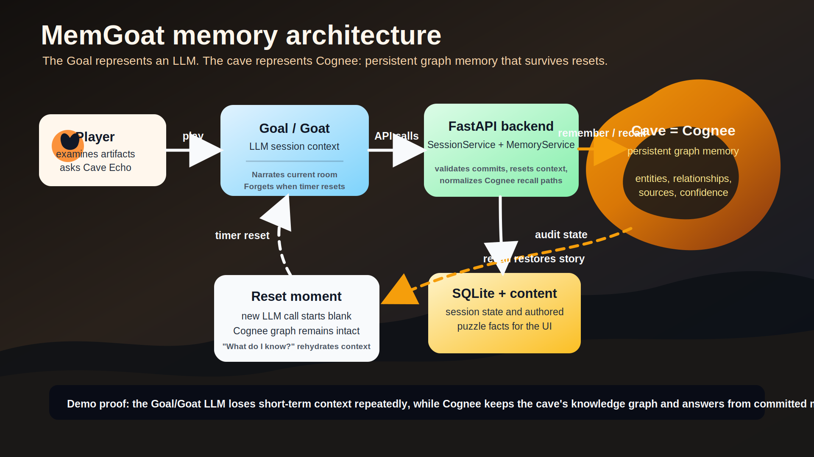
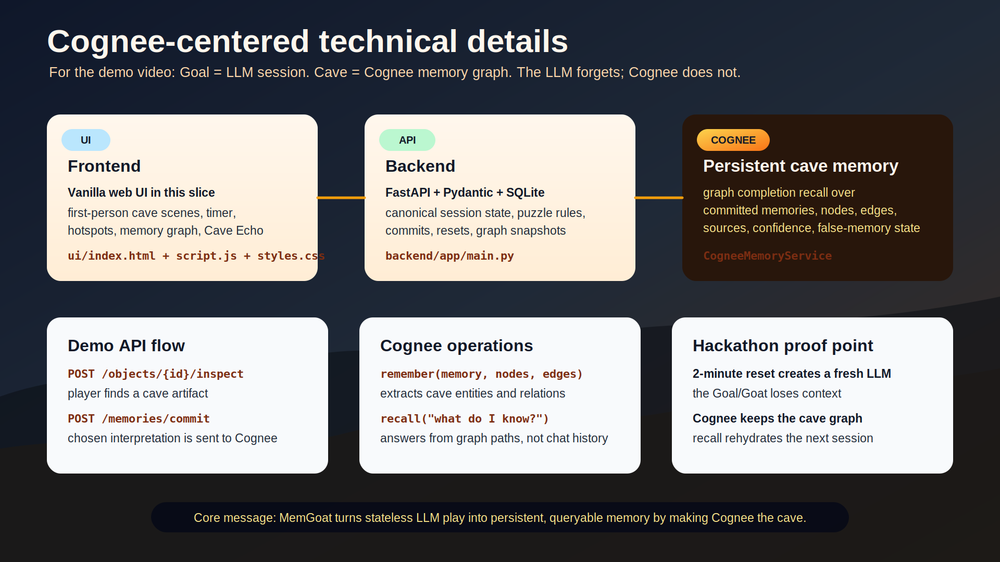

# MemGoat

<p align="center">
  
</p>

<p align="center">
  <strong>The goat forgets. The cave remembers.</strong>
</p>

<p align="center">
  <a href="https://youtu.be/9RDGRYVZ9bE">Watch the demo</a>
  |
  <a href="https://www.wemakedevs.org/hackathons/cognee">WeMakeDevs x Cognee Hackathon</a>
  |
  <a href="#run-it-locally">Run it locally</a>
</p>

MemGoat is an atmospheric browser game about memory, identity, and what happens when an AI loses the thread. It is our entry for WeMakeDevs and Cognee's hackathon, [The Hangover Part AI: Where's My Context?](https://www.wemakedevs.org/hackathons/cognee).

The experience is intentionally simple to understand: you wake up as a goat in a cave with no memory of who you are. Every two minutes, your short-term memory collapses. The only thing that persists is the Cave Echo, a living memory graph powered by Cognee.

## Demo

<p align="center">
  <a href="https://youtu.be/9RDGRYVZ9bE">
    
  </a>
</p>

Watch the walkthrough here: [MemGoat demo video](https://youtu.be/9RDGRYVZ9bE).

## The Story

The goat wakes in a witch-worked ruin with nothing but fragments: a cracked locket, a dead lantern, scratched warnings, and a voice that says it has forgotten again.

The goal is not only to escape the cave. The goal is to reconstruct a self.

In the first playable chain, **The Last Lantern**, the player moves through three sealed chambers:

- **Waking Chamber** - learn that a name, a lantern, and a sealing threshold matter.
- **Bell Gallery** - connect earlier clues and refine the name Nara into the keeper of the Last Lantern.
- **Root Gate** - confront a false memory, dismiss it, and ask the Cave Echo who the goat really is.

The final realization is the heart of the project:

> I was not escaping the cave. I was escaping forgetfulness.

## The Metaphor

MemGoat turns an AI architecture problem into something playable.

The **goat** is the LLM. It can speak, reason, and react inside the current moment, but its working context is fragile. When the timer resets, the goat starts again with no reliable short-term memory.

The **cave** is Cognee. It holds persistent memory outside the LLM context window: entities, relationships, sources, confidence, and contradictions. The Cave Echo can answer questions from committed memories even after the goat forgets.

The **player** is the agent designer. Every clue is not automatically saved. The player has to decide what should become memory, which mirrors the real challenge of choosing what context an AI system should preserve.

The **Witch** is memory corruption. She injects plausible false memories, forcing the player to inspect source trust, remove bad context, and see how wrong memory can poison future recall.

## Why Memory Matters

Most LLM interactions are shaped by the context they receive right now. If important context is missing, the model may repeat itself, lose continuity, or confidently answer from incomplete information.

MemGoat makes that invisible limitation visible. When the goat forgets, progress would be impossible if memory lived only in the current conversation. Cognee gives the experience a persistent graph-vector memory layer, so the next session can recover:

- who the goat is,
- what objects were discovered,
- which clues are connected,
- what source each memory came from,
- which memory was false,
- and what path leads forward.

## What You Can Do

- Inspect cave objects and choose the strongest memory interpretation.
- Commit memories into the Cave Echo.
- Watch the persistent memory graph grow as nodes and relationships appear.
- Ask natural-language questions like "What do I know?" or "Who am I?"
- Survive timer resets where the goat forgets but the cave remembers.
- Identify and dismiss a false memory before it misleads recall.
- Reach the Root Gate by reconstructing identity from connected memories.

## Architecture

MemGoat is a local-first web app with a FastAPI backend, a static browser UI, SQLite session persistence, authored puzzle content, and a swappable memory provider. Cognee is the primary memory backend for the project, while the mock provider keeps local development and tests reliable.



The core separation is the product claim:

- **Goat session context resets.** The short-lived LLM-style state is intentionally fragile.
- **Cave memory persists.** Committed memories survive resets in Cognee and backend state.
- **Recall restores context.** The player can ask the Cave Echo to reconstruct what matters from the graph.

## Technical Flow



The main loop is:

1. The frontend renders the cave, timer, hotspots, Echo Graph, and Cave Voice.
2. The player inspects an object and chooses a candidate memory.
3. FastAPI validates the choice against authored content.
4. SQLite records canonical session state for the demo and UI.
5. `MemoryService` sends committed memory, nodes, edges, and metadata to Cognee.
6. The player asks a question through Cave Voice.
7. Cognee recall returns an answer from persistent memory instead of chat history.
8. The UI highlights the relevant graph path and updates the story.

## Project Structure

- `backend/` - FastAPI app, content loader, SQLite persistence, memory services, and backend tests.
- `backend/content/chains/last-lantern.json` - authored story, rooms, hotspots, candidate memories, false memory, and final recall path.
- `ui/` - static HTML/CSS/JS frontend integrated with the backend API.
- `ui/assets/` - title art, cave images, object clues, audio, and architecture diagrams.
- `scripts/verify-local.ps1` - end-to-end local verification script.
- `reference/` - product, UX, architecture, and implementation notes.

## Run It Locally

### Prerequisites

- Python 3.11 or newer.
- PowerShell, for the provided local verification script.

### Backend Setup

From the repository root:

```powershell
cd backend
python -m venv .venv
.\.venv\Scripts\Activate.ps1
python -m pip install -r requirements.txt
```

For local development, use the mock memory provider unless you have Cognee credentials configured:

```powershell
$env:MEMGOAT_MEMORY_PROVIDER = "mock"
$env:MEMGOAT_DEMO_MODE = "false"
python -m uvicorn app.main:app --host 127.0.0.1 --port 8000 --reload
```

The backend health endpoint is available at:

```text
http://127.0.0.1:8000/api/health
```

### Frontend Setup

In a second terminal, from the repository root:

```powershell
cd ui
python -m http.server 5173 --bind 127.0.0.1
```

Open the app at:

```text
http://127.0.0.1:5173
```

The static UI calls `http://127.0.0.1:8000` directly.

## Environment Variables

The backend reads environment variables directly or from `backend/.env`.

Common local settings:

```dotenv
MEMGOAT_ENV=development
MEMGOAT_MEMORY_PROVIDER=mock
MEMGOAT_DEMO_MODE=false
MEMGOAT_TIMER_SECONDS=120
MEMGOAT_DB_PATH=data/memgoat.sqlite
MEMGOAT_CONTENT_ROOT=content/chains
```

Optional external memory and LLM settings:

```dotenv
MEMGOAT_MEMORY_PROVIDER=cognee
COGNEE_API_BASE_URL=
COGNEE_TENANT_ID=
COGNEE_API_KEY=
OPEN_ROUTER_KEY=
OPEN_ROUTER_MODEL=
```

## Tests

Run backend tests:

```powershell
cd backend
.\.venv\Scripts\python.exe -m pytest
```

Check frontend syntax:

```powershell
cd ui
node --check script.js
```

## Local Verification

After installing backend dependencies, run the local smoke test from the repository root:

```powershell
.\scripts\verify-local.ps1
```

The script starts the backend and static UI server, verifies the app shell loads, walks the backend room and memory flow, and writes `output/local-smoke/smoke-result.json`.

<p><sub>Codex was used to assist with code generation for this project.</sub></p>
