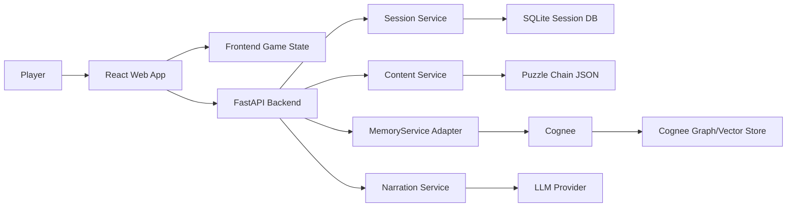

# MemGoat: The Cave Echo

High-Level Technical Specification Draft v0.1

Source requirements: `reference/MemGoat UX Requirements.md`  
Status: Draft for architecture and stack decision  
Product type: judge-demo vertical slice  

## 1. Executive Summary

MemGoat should be built as a local-first web game with a lightweight game frontend, a Python backend, and Cognee as the persistent memory graph layer.

The vertical slice is not a physics-heavy game. Its core technical challenge is making memory feel real: the goat's short-term context resets, the Cave Echo persists discovered memories, natural-language questions traverse a visible graph, false memories can pollute recall, and refined discoveries update existing memory instead of duplicating it.

Recommended default stack:

- Frontend: React, Vite, TypeScript.
- UI styling: CSS modules or plain scoped CSS, with a small component system.
- Cave scenes: pending final rendering choice; either illustrated hotspot scenes or a tightly scoped Three.js cave diorama.
- Graph visualization: React Flow.
- Backend API: FastAPI.
- Backend language: Python.
- Content format: authored JSON modules validated with Pydantic.
- Game/session state: SQLite.
- Persistent memory: Cognee behind a `MemoryService` adapter.
- LLM use: bounded and structured; authored content remains canonical.
- Demo controls: real two-minute timer plus presenter-only reset/fast-forward controls.

Primary recommendation: use a Cognee-primary memory architecture. Authored puzzle content defines what can be discovered and committed, but recall, graph traversal, and recovery should come from Cognee rather than a deterministic answer fallback. This better fits the hackathon requirement that Cognee is the central technical mechanism, not a decorative storage layer.

## 2. Product Requirements That Drive Architecture

The UX requirements imply the following technical requirements:

1. The player must experience a first-person cave view with inspectable objects.
2. The player must actively choose one of 2-3 memory interpretations before memory is persisted.
3. Uncommitted observations must disappear when the timer resets.
4. Committed memories must persist across timer resets.
5. The goat's narration and short-term context must reset independently from the Cave Echo.
6. A right-side Cave Echo panel must show timer, memory graph, query input, recall result, selected memory details, and false-memory actions.
7. Natural-language questions must return concise answers and highlighted graph paths.
8. The system must support at least one false-memory injection and dismissal.
9. The system must support at least one memory refinement where an existing node or relationship evolves.
10. The system must support one-way room progression, making previous-room memories retrievable only through the Cave Echo.
11. The full vertical slice must be reliable in a 5-7 minute manual judge demo.
12. Critical audio events must have visual equivalents.

The architecture should prioritize Cognee-first recall, visible graph state, content authoring clarity, strong observability, and clean separation between short-term session context and persistent memory.

## 3. Recommended Architecture



### 3.1 Frontend Responsibilities

The frontend owns the live play experience:

- Render first-person room scenes.
- Render clickable hotspots and examined states.
- Run the visible countdown timer.
- Open inspection states for selected objects.
- Present candidate memory interpretations.
- Render the Cave Echo panel.
- Render memory graph nodes, edges, selected memory details, and highlighted recall paths.
- Play sound cues and show visual equivalents.
- Call backend APIs for commit, recall, dismiss, refine, reset, and room transition.
- Support a presenter-only demo control surface.

The frontend should not own canonical puzzle rules. It may cache room state for responsiveness, but backend state is authoritative.

### 3.2 Backend Responsibilities

The backend owns game truth and memory integration:

- Create and scope game sessions.
- Load puzzle chain modules.
- Validate room transitions.
- Validate which object interpretations are available.
- Persist committed memories and object states.
- Track dismissed, suspicious, refined, and false memories.
- Reset goat session context without clearing persistent memory.
- Call Cognee through a stable adapter.
- Return graph snapshots and recall paths in a frontend-friendly shape.
- Validate and normalize Cognee recall responses into a frontend-friendly shape.
- Surface Cognee uncertainty or missing-memory states in-world rather than substituting authored answers.

### 3.3 Memory Layer Responsibilities

The memory layer represents the Cave Echo:

- Persist committed memories across resets.
- Store meaningful nodes and relationships, not raw log lines.
- Support categories: identity, place, object, person/voice, cause, question, mistake/false memory.
- Support relationship types: leads_to, opens, contradicts, refines, belongs_to, names, carried_by, listens_for.
- Support suspicious and false-memory metadata.
- Support memory refinement by updating existing canonical nodes or relationships.
- Return recall answers with source memories and graph paths.

Cognee should be used for the real memory demonstration, but all calls should go through `MemoryService` so the product can switch between Cognee Cloud and self-hosted Cognee without changing the UI. A mock memory provider may exist for local unit tests, but the playable demo should not use deterministic recall fallback.

## 4. Stack Options and Recommendations

### 4.1 Frontend Framework

| Option | Pros | Cons | Recommendation |
| --- | --- | --- | --- |
| React + Vite + TypeScript | Fast setup, strong component model, good graph library support, low ceremony | Requires manual routing/state choices | Recommended |
| Next.js | Good deployment story, integrated routing/API patterns | More framework than needed; backend is already Python | Not recommended for first slice |
| Vanilla JS | Minimal tooling, fast for tiny prototypes | Harder to maintain graph UI and complex state | Not recommended |
| Phaser | Useful for game loops and sprites | The UX is not movement-heavy; side panel UI is more important | Not recommended |
| Three.js | Strong 3D potential for the cave view | Not an app framework; should be embedded inside React if used | Consider only for constrained cave rendering |

Decision: React + Vite + TypeScript approved.

### 4.2 Cave Scene Rendering

| Option | Pros | Cons | Recommendation |
| --- | --- | --- | --- |
| Illustrated stills with hotspot overlays | Fast, readable, atmospheric, easiest to art-direct, lowest implementation risk | Less interactive and less visually distinctive | Safest |
| Layered 2D canvas | Allows parallax, light flicker, fog, and scene sealing effects | More custom rendering work than CSS hotspots | Safe enhancement |
| Three.js constrained diorama | Memorable, immersive, supports first-person inspection, strong judge appeal | Requires asset discipline, browser testing, camera/hotspot work, and render QA | Viable if tightly scoped |
| Full 3D cave navigation | Most game-like | Too much camera, movement, collision, level design, and asset work for the vertical slice | Reject |
| Text adventure | Fastest | Fails the first-person cave UX requirement | Reject |

Deeper Three.js assessment:

Three.js is not automatically too much for the hackathon, but a full 3D cave game is too much. The viable version is a constrained first-person diorama embedded inside the React app:

- Use React for the main app, state, Cave Echo panel, and forms.
- Use Three.js or React Three Fiber only for the left cave view.
- Use a locked or lightly movable camera, not free movement.
- Build three small scenes only: Waking Chamber, Bell Gallery, Root Gate.
- Represent objects as clickable meshes, planes, sprites, or simple low-poly props.
- Use generated painterly textures, simple geometry, fog, point lights, and subtle camera sway to create atmosphere.
- Use raycasting for hotspots and selection.
- Use close-up overlays or camera tweening for inspection rather than physically navigating to objects.
- Keep one-way room progression as a scene swap, not continuous traversal.

Three.js becomes too risky if the scope expands to free movement, collisions, realistic cave geometry, animated characters, complex asset pipelines, or puzzle interactions that depend on precise 3D positioning.

Recommended rendering decision:

- If the priority is maximum delivery confidence: choose illustrated stills with hotspot overlays.
- If the priority is stronger judge impact and the team can keep the 3D scope disciplined: choose a Three.js constrained diorama.

Current recommendation after deeper review: Three.js constrained diorama is acceptable for this hackathon only if treated as a visual interaction layer, not as a full game engine. The implementation should still keep the React/FastAPI/Cognee architecture unchanged.

Decision needed: choose illustrated hotspot scenes or Three.js constrained diorama.

### 4.3 Backend Framework

| Option | Pros | Cons | Recommendation |
| --- | --- | --- | --- |
| FastAPI | Python-native, async-friendly, works well with Cognee SDK and Pydantic | Requires separate frontend/backend dev servers | Recommended |
| Flask | Simple | Less built-in validation and API typing | Acceptable but weaker |
| Node/Express | Same language as frontend | Cognee integration is expected to be better in Python | Not recommended |
| Full frontend-only app | Simplest deployment | Cannot cleanly isolate Cognee, LLM, secrets, or session state | Reject |

Decision: FastAPI approved.

### 4.4 Memory Implementation

| Option | Pros | Cons | Recommendation |
| --- | --- | --- | --- |
| Cognee-primary recall | Strongest technical story; best alignment with hackathon requirement | Requires prompt/content discipline, observability, and rehearsal | Recommended |
| Deterministic authored graph only | Reliable and fast | Cognee may feel decorative | Not recommended alone |
| Hybrid Cognee plus deterministic answer fallback | Reliable while still demonstrating some Cognee usage | Undercuts the central Cognee requirement if used for demo-critical recall | Reject for judge demo |

Recommended approach:

- Ingest committed memories into Cognee.
- Store canonical memory records, source objects, and session state in SQLite for UI and auditability.
- Ask Cognee for recall/query results.
- Normalize results into the UI response shape.
- Do not substitute deterministic authored answers for failed Cognee recall during the judge demo.
- Use authored content to make Cognee success more likely: short memory text, explicit entity names, relationship-oriented phrasing, and canonical query examples.
- Add health checks and rehearsal scripts that verify Cognee can answer the required demo questions before the demo starts.
- Log Cognee responses for post-demo explanation.

Decision: Cognee-primary memory architecture approved by product direction.

### 4.5 Cognee Deployment

| Option | Pros | Cons | Recommendation |
| --- | --- | --- | --- |
| Cognee Cloud | Fastest and easiest demo setup | External dependency; may be less open-source-forward | Recommended for first demo |
| Self-hosted Cognee | Stronger open-source story, more control | More setup and runtime risk | Consider if judging track rewards this |
| Adapter supports both | Keeps product flexible | Slight upfront abstraction work | Recommended architecture |

Recommended approach: design for both, run Cloud first unless the submission is explicitly targeting an open-source/self-hosted prize category.

Decision: Cognee Cloud-first behind a swappable adapter approved.

### 4.6 LLM Usage

| Option | Pros | Cons | Recommendation |
| --- | --- | --- | --- |
| LLM for narration, interpretation, recall | Most dynamic | Hardest to control in a 5-minute demo | Not recommended |
| Authored content plus LLM/Cognee recall | Reliable but still AI-native | Requires content discipline | Recommended |
| No LLM-facing behavior | Very reliable | Weakens stateless LLM metaphor | Not recommended |

Recommended approach:

- Author object descriptions, candidate interpretations, room transitions, false-memory copy, and final lines.
- Use LLM/Cognee for natural-language recall and summary shaping.
- Use strict backend schemas for query responses.
- Keep a short-lived `goat_session_context` that is deleted on reset.
- Keep the Cave Echo graph persistent.

Decision: bounded LLM usage approved.

### 4.7 Graph Visualization

| Option | Pros | Cons | Recommendation |
| --- | --- | --- | --- |
| React Flow | Interactive, selection support, path highlighting, custom node styles | Adds dependency | Recommended |
| D3 | Powerful and custom | More implementation time | Not recommended first |
| Static SVG | Predictable | Harder to update interactively | Acceptable backup option |
| Text/tree only | Fast | Weakens the Cognee proof moment | Not recommended |

Decision: React Flow approved.

### 4.8 State Persistence

| Option | Pros | Cons | Recommendation |
| --- | --- | --- | --- |
| Browser-only state | Fastest | Fragile, hard to integrate with Cognee/user scoping | Not recommended |
| SQLite backend state | Simple, reliable, local demo-friendly | Not horizontally scalable | Recommended |
| Postgres | Production-ready | Unnecessary for vertical slice | Defer |
| Redis | Good for ephemeral state | Needs persistent complement | Defer |

Decision: SQLite approved for the vertical slice.

## 5. High-Level Data Model

### 5.1 Game Session

```ts
type GameSession = {
  sessionId: string;
  playerId: string;
  chainId: "last_lantern";
  currentRoomId: string;
  goatContextId: string;
  memoryWindowStartedAt: string;
  memoryWindowDurationSeconds: number;
  resetCount: number;
  demoMode: boolean;
  completed: boolean;
};
```

### 5.2 Room

```ts
type Room = {
  id: string;
  title: string;
  sceneAsset: string;
  ambienceAsset?: string;
  hotspots: Hotspot[];
  exits: RoomExit[];
};
```

### 5.3 Hotspot/Object

```ts
type Hotspot = {
  id: string;
  label: string;
  bounds: { x: number; y: number; width: number; height: number };
  examinedStateAsset?: string;
  inspection: {
    title: string;
    sensoryText: string;
    candidateMemories: CandidateMemory[];
  };
};
```

### 5.4 Candidate Memory

```ts
type CandidateMemory = {
  id: string;
  text: string;
  category: "identity" | "place" | "object" | "person" | "cause" | "question" | "mistake";
  correctness: "correct" | "incomplete" | "misleading" | "false";
  confidence: "strong" | "weak" | "suspicious";
  sourceObjectId: string;
  createsNodes: string[];
  createsEdges: string[];
  refinesMemoryId?: string;
};
```

### 5.5 Memory Node

```ts
type MemoryNode = {
  id: string;
  label: string;
  category: string;
  status: "new" | "reinforced" | "refined" | "suspicious" | "false" | "dismissed";
  confidence: number;
  sourceObjectIds: string[];
  createdAt: string;
  refinedFrom?: string;
};
```

### 5.6 Memory Edge

```ts
type MemoryEdge = {
  id: string;
  from: string;
  to: string;
  relation:
    | "leads_to"
    | "opens"
    | "contradicts"
    | "refines"
    | "belongs_to"
    | "names"
    | "carried_by"
    | "listens_for";
  status: "active" | "suspicious" | "dismissed";
  sourceObjectIds: string[];
};
```

### 5.7 Recall Response

```ts
type RecallResponse = {
  answer: string;
  certainty: "known" | "partial" | "unknown" | "contradicted";
  pathNodeIds: string[];
  pathEdgeIds: string[];
  supportingMemoryIds: string[];
  missingMemoryHint?: string;
  provider: "cognee";
  rawProviderTraceId?: string;
};
```

## 6. Content Module Model

The first release ships one puzzle chain: `The Last Lantern`.

Recommended file layout:

```text
content/
  chains/
    last-lantern.json
  schemas/
    chain.schema.json
  assets/
    scenes/
    objects/
    audio/
```

Each chain module defines:

- Chain metadata.
- Rooms.
- One-way transitions.
- Hotspot positions.
- Object inspection text.
- Candidate memory interpretations.
- Correct, incomplete, misleading, and false memories.
- Expected graph nodes and edges.
- Trigger rules for false memory injection.
- Trigger rules for memory refinement.
- Final recall requirements.
- Demo script checkpoints.

The content module should be authoritative for puzzle logic. Cognee should enrich and retrieve memory, not invent puzzle-critical facts.

## 7. API Surface

### 7.1 Session

```http
POST /api/sessions
GET /api/sessions/{session_id}
POST /api/sessions/{session_id}/reset
POST /api/sessions/{session_id}/demo/fast-forward
```

`reset` creates a new goat short-term context while preserving committed Cave Echo memories.

### 7.2 Room and Object Flow

```http
GET /api/sessions/{session_id}/room
POST /api/sessions/{session_id}/objects/{object_id}/inspect
POST /api/sessions/{session_id}/memories/commit
POST /api/sessions/{session_id}/rooms/{room_id}/exit
```

`inspect` returns sensory text and candidate memory interpretations. It does not persist memory by itself.

`commit` persists the selected interpretation into SQLite and Cognee, then returns an updated graph snapshot.

### 7.3 Cave Echo

```http
POST /api/sessions/{session_id}/echo/ask
GET /api/sessions/{session_id}/echo/graph
GET /api/sessions/{session_id}/echo/memories/{memory_id}
POST /api/sessions/{session_id}/echo/memories/{memory_id}/dismiss
```

`ask` returns a structured recall response with answer, path, support, and missing-memory hints.

`dismiss` marks or removes the memory for the current run and updates future recall results.

### 7.4 Events and Audio

```http
GET /api/sessions/{session_id}/events
```

Events may include:

- timer_started
- timer_warning
- memory_committed
- recall_path_revealed
- memory_refined
- false_memory_introduced
- false_memory_dismissed
- room_sealed
- goat_reset
- final_reconstruction

The frontend can map these events to sound cues and visual equivalents.

## 8. Core Flows

### 8.1 Observe, Interpret, Commit

1. Player clicks a room hotspot.
2. Frontend calls `inspect`.
3. Backend returns sensory inspection text and 2-3 candidate interpretations.
4. Player chooses a candidate.
5. Frontend calls `commit`.
6. Backend validates candidate availability.
7. Backend persists canonical memory state.
8. Backend calls `MemoryService.remember`.
9. Backend returns updated graph.
10. Frontend updates object examined state and graph panel.

### 8.2 Ask the Cave Echo

1. Player enters a natural-language question.
2. Frontend calls `echo/ask`.
3. Backend sends query and session scope to `MemoryService.recall`.
4. Backend maps Cognee output to canonical graph nodes and edges.
5. If result is incomplete, backend returns a partial or unknown response with an in-world missing-memory hint.
6. Backend returns answer, certainty, path, supporting memories, missing hints, and provider trace ID.
7. Frontend displays concise answer and highlights graph path when Cognee returns one.

### 8.3 Timer Reset

1. Timer reaches zero or presenter triggers reset.
2. Frontend calls `session/reset`.
3. Backend clears goat short-term context.
4. Backend increments reset count.
5. Backend does not delete committed memories.
6. Frontend shows confusion narration and reset visual/audio state.
7. Player can ask "What do I know?"
8. Cave Echo recalls graph state and restores player orientation.

### 8.4 False Memory

1. Trigger condition fires in Root Gate room.
2. Backend inserts false memory with suspicious metadata and Witch source.
3. Frontend renders suspicious/visually distinct graph branch.
4. Player inspects the memory.
5. Details show weak or untrustworthy source.
6. Player dismisses memory after confirmation.
7. Backend marks memory dismissed and excludes it from recall.
8. Graph visibly cleans up.

### 8.5 Memory Refinement

1. Player commits a later clue that has `refinesMemoryId`.
2. Backend updates the existing memory node instead of adding a duplicate concept.
3. Backend records previous text/status for inspection history.
4. Backend calls `MemoryService.improve` or equivalent adapter behavior if available.
5. Frontend animates node refinement and updates details.

## 9. Demo Reliability Controls

The product must support a real manual judge demo and a presenter-guided demo.

Required controls:

- Real visible two-minute timer.
- Configurable timer duration in environment/config.
- Presenter reset trigger.
- Presenter timer fast-forward.
- Seed/reset game session button.
- Optional "show expected demo path" only in non-judge debug mode.

Reliability guardrails:

- Critical memories and expected graph paths are authored.
- Critical recall still goes through Cognee.
- Key recall questions have preflight checks against a seeded demo session.
- Memory text is authored to be relationship-explicit so Cognee can extract the intended entities and edges.
- Query normalization maps common player phrasing to stronger Cognee prompts without changing the meaning of the question.
- Backend never exposes raw Cognee or LLM errors to the player.
- If Cognee is unavailable, the Cognee-backed demo is considered unhealthy rather than silently falling back to deterministic recall.
- Natural-language query handling should normalize common phrasing such as "Who am I?", "What do I know?", "How do I open the root gate?", and "What name should the gate hear?"
- Provider traces should be logged so the team can show that recall came from Cognee during technical judging.

## 10. Accessibility and UX Technical Requirements

Implementation must support:

- Mouse and keyboard interaction.
- Readable text during screen sharing.
- Visible focus states for hotspots and controls.
- Timer state expressed through text, shape, motion, and sound, not color alone.
- Captions or visual equivalents for critical audio/story beats.
- No dependency on sound for puzzle completion.
- Responsive layout where the cave and Cave Echo panel stack on narrow screens.
- Graph path highlighting that remains legible without zooming during desktop demo.

## 11. Asset Strategy

Recommended first-slice assets:

- Three room backgrounds: Waking Chamber, Bell Gallery, Root Gate.
- Object close-up images for key artifacts.
- Hotspot overlay states.
- Memory graph node icons by category.
- Sound cues for the required UX events.

Asset production options:

| Option | Pros | Cons | Recommendation |
| --- | --- | --- | --- |
| AI-generated painterly stills | Fast and visually aligned with UX | Requires consistency passes | Recommended |
| Hand-drawn assets | Best control | Slower | Use if available |
| Public-domain/stock cave images | Fast | Less specific; may feel generic | Only as placeholder |
| SVG-only scenes | Easy to edit | Less atmospheric | Not recommended |

## 12. Environment and Configuration

Suggested environment variables:

```text
MEMGOAT_ENV=development
MEMGOAT_DEMO_MODE=true
MEMGOAT_TIMER_SECONDS=120
MEMGOAT_CONTENT_ROOT=content/chains
MEMGOAT_DB_PATH=data/memgoat.sqlite
MEMGOAT_MEMORY_PROVIDER=cognee_cloud
COGNEE_API_KEY=...
COGNEE_PROJECT_ID=...
LLM_PROVIDER=...
LLM_API_KEY=...
```

Secrets must stay backend-side.

## 13. Testing Strategy

### 13.1 Unit Tests

- Content schema validation.
- Room transition rules.
- Candidate memory validation.
- Timer reset state behavior.
- False-memory dismissal behavior.
- Memory refinement behavior.
- Query normalization.

### 13.2 Integration Tests

- Commit memory updates SQLite and MemoryService.
- Recall returns graph path for "What do I know?"
- Recall returns graph path for "How do I open the root gate?"
- Dismissed false memory is excluded from future recall.
- Reset clears goat context but preserves Cave Echo memory.

### 13.3 Demo Script Test

Automate or manually verify the required demo sequence:

1. Start confused.
2. Timer starts.
3. Commit identity clue.
4. Commit environmental clue.
5. Graph updates.
6. Move through one-way transition.
7. Ask a question that uses earlier-room memory.
8. Trigger reset.
9. Ask "What do I know?"
10. Refine an earlier memory.
11. Introduce false memory.
12. Dismiss false memory.
13. Ask how to open the Root Gate.
14. Show final chain.
15. End with identity reconstruction.

## 14. Implementation Milestones

### Milestone 1: Playable Skeleton

- React app shell with two-zone layout.
- FastAPI service with session creation.
- Load `last-lantern` content module.
- Render one room with hotspots.
- Inspect object and choose memory.
- Show static graph update.

### Milestone 2: Memory Loop

- SQLite session and memory persistence.
- Cognee adapter interface.
- Commit memory to adapter.
- Ask Cave Echo and render recall result.
- Highlight graph path.

### Milestone 3: Reset and One-Way Progression

- Visible configurable timer.
- Reset clears goat context only.
- Ask "What do I know?" after reset.
- One-way room transition with warning and sealed state.

### Milestone 4: False Memory and Refinement

- Witch false-memory injection.
- Suspicious graph styling.
- Inspect and dismiss memory.
- Refinement updates existing node.

### Milestone 5: Final Recall and Polish

- Root Gate final recall.
- Final reconstruction scene.
- Sound cues and visual equivalents.
- Demo controls.
- End-to-end demo rehearsal.

## 15. Key Risks and Mitigations

| Risk | Impact | Mitigation |
| --- | --- | --- |
| Cognee recall is inconsistent for puzzle-critical queries | Demo may fail | Author relationship-explicit memories, normalize query phrasing, run Cognee preflight checks, and rehearse with seeded sessions |
| Too much content scope | Vertical slice misses polish | Build only The Last Lantern first |
| Graph becomes unreadable | Judges miss core concept | Use curated layout and highlight only relevant path |
| LLM narration drifts | Tone or puzzle facts become inconsistent | Author puzzle-critical copy |
| Timer pressure frustrates early play | Judge may miss key memories | Configurable timer and presenter controls |
| False-memory dismissal is unclear | Doubt mechanic fails | Show source trust, contradiction, and before/after graph state |
| Asset generation takes too long | UI feels unfinished | Start with strong placeholders and lock scene composition early |

## 16. Decision Worksheet

This section is the shortest path to moving from draft to implementation. If all recommended defaults are accepted, the team can proceed directly to the implementation milestones in section 14.

| Choice | Recommended Selection | Alternative To Pick If... |
| --- | --- | --- |
| Frontend framework | React + Vite + TypeScript | Approved. Pick Next.js only if deployment/routing becomes more important than build speed. |
| Cave rendering | Pending: illustrated hotspots or Three.js constrained diorama | Pick Three.js only if it remains a locked-camera visual layer, not a full 3D game. |
| Backend framework | FastAPI | Approved. Pick Flask only if the team wants fewer framework concepts and accepts weaker API typing. |
| Memory architecture | Cognee-primary recall, no deterministic demo fallback | Approved. Revisit only if the hackathon rules allow non-Cognee recall, which is not the current product direction. |
| Cognee deployment | Cloud-first behind adapter | Approved. Pick self-hosted-first only if open-source positioning becomes more important than setup speed. |
| Graph visualization | React Flow | Approved. Pick static SVG only if dependency count must be minimized. |
| Session state | SQLite | Approved. Pick Postgres only if simultaneous public playtesting becomes a real requirement. |
| Content format | JSON plus Pydantic validation | Approved. Pick YAML only if content authors strongly prefer hand-editable prose-like files. |
| LLM usage | Authored core content plus bounded recall/summarization | Approved. Pick broader LLM use only after the Cognee-primary demo path is stable. |
| Demo controls | Real timer plus presenter fast-forward/reset | Approved. Remove presenter controls only after repeated manual demos prove timing is reliable. |

Current approval statement:

> Approved defaults: React + Vite + TypeScript, FastAPI, Cognee-primary memory with no deterministic demo fallback, Cognee Cloud-first behind an adapter, React Flow, SQLite, JSON content modules, bounded LLM usage, and presenter demo controls. Cave rendering remains pending between illustrated hotspot scenes and a constrained Three.js diorama.

Minimum decision needed before implementation:

1. Illustrated hotspot scenes or Three.js constrained diorama.

## 17. UX Requirement Traceability

| UX Requirement Area | Technical Design Response |
| --- | --- |
| Product goal: goat forgets, Cave Echo remembers | Separate short-lived `goat_session_context` from persistent Cognee-backed `MemoryService`; reset clears only goat context. |
| 5-minute judge-demo vertical slice | Single authored chain, demo milestones, Cognee preflight checks, query normalization, and presenter controls. |
| Memory is the main character | Right-side Cave Echo panel, React Flow graph, commit/recall/dismiss/refine APIs, graph-first response model. |
| Forgetting must be felt | Visible timer, reset endpoint, reset events, confusion narration, and preserved graph state. |
| Graph traversal must be legible | Recall response includes answer, supporting memories, path node IDs, path edge IDs, and highlighted graph path. |
| Doubt must be playable | False-memory status, suspicious source metadata, inspect/dismiss flow, and graph cleanup after dismissal. |
| Ending must reframe the demo | Final recall flow reconstructs identity, place, objects, false memory, and correct Root Gate path. |
| First-person cave view | Pending rendering decision: illustrated room assets with embedded hotspots, or constrained Three.js diorama with raycast hotspots and locked camera. |
| Active memory capture | Inspect returns candidate interpretations; commit is the only persistence point. |
| Natural-language questions | `/echo/ask` normalizes player queries and uses Cognee through `MemoryService.recall`. |
| Memory refinement | Candidate memories can define `refinesMemoryId`; backend updates existing nodes rather than duplicating. |
| One-way room progression | Backend validates exits and seals prior rooms; prior clues are recoverable only through the graph. |
| The Last Lantern chain | Content module model ships one canonical `last-lantern` chain first. |
| Sound and accessibility | Event stream maps memory/timer/reset/final beats to audio plus visual equivalents. |
| Error and empty states | Backend returns in-world missing-memory hints and hides raw LLM/Cognee errors. |

## 18. Decision Log

| Decision | Recommended Default | Status |
| --- | --- | --- |
| Frontend framework | React + Vite + TypeScript | Approved |
| Cave rendering | Illustrated hotspots or constrained Three.js diorama | Needs final choice |
| Backend framework | FastAPI | Approved |
| Memory architecture | Cognee-primary recall, no deterministic demo fallback | Approved |
| Cognee deployment | Adapter supports both; Cloud first for demo | Approved |
| Graph visualization | React Flow | Approved |
| Session state | SQLite | Approved |
| Content format | JSON modules validated with Pydantic | Approved |
| LLM usage | Authored core content plus bounded recall/summarization | Approved |
| Demo controls | Real timer plus presenter fast-forward/reset | Approved |

## 19. Open Questions for Product/Technical Choice

1. Should the cave view use illustrated hotspot scenes or a constrained Three.js diorama?
2. If Three.js is selected, should the implementation use plain Three.js or React Three Fiber?
3. Should the presenter controls be visible behind a keyboard shortcut or a small demo-only panel?

## 20. Recommended Final Choices

Unless there is a specific reason to optimize for a different judging track, the recommended choices are:

1. React + Vite + TypeScript frontend.
2. FastAPI backend.
3. React Flow memory graph.
4. JSON content modules with Pydantic validation.
5. SQLite for local session state.
6. Cognee Cloud first, behind a swappable adapter.
7. Cognee-primary recall with no deterministic demo fallback.
8. Authored copy for all puzzle-critical content.
9. LLM/Cognee for recall phrasing, graph traversal demonstration, and recovery summaries.
10. Real two-minute timer with presenter-only fast-forward/reset.
11. Cave rendering still requires a final call: illustrated hotspot scenes for delivery confidence, or constrained Three.js diorama for stronger visual impact.

These choices best support the UX requirement that the player remembers the ending, not the implementation complexity.
